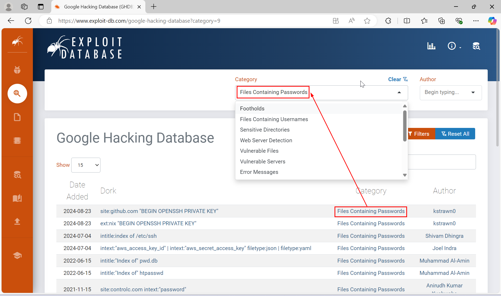

[<< Back](../README.md)
---

# Google Dorking
***ภาษาไทย: *การใช้ Google อย่างมีประสิทธิภาพ

## ข้อมูลที่ควรเข้าใจ
Google คือ Search Engine ที่ใหญ่และดีที่สุดของโลก นั้นจึงเป็นเครื่องมือที่ดีมากๆ ของ Hacker ในการค้นคว้าหาข้อมูลของเป้าหมาย โดยสิ่งที่พิเศษใน Google ก็คือเราสามารถใช้ Query แทนที่การพิมพ์แค่ Keyword แบบเดิมๆ เฉพาะในการค้นหาได้

## การทดสอบ
- [Google Search Operator](#google-search-operator)
- [Google Hacking Database](#google-hacking-database)
- [Pentest-Tools](#pentest-tools)

### Google Search Operator

นี่คือรายการ Query Operator ที่รองรับโดย Google
- `Filetype:` กรองผลการค้นหาด้วยนามสกุล (สามารถใช้ `ext:` ได้เช่นกัน ทำงานเหมือนกัน)

```
filetype: pdf
filetype: pdf,xlsx
filetype: php,html
filetype: txt,php,html
ext: pdf
exit: pdf.xlsx
```

- `Inurl:` ค้นหาโดยอิงจากข้อความที่อยู่บน URL
```
inurl:password
inurl:userid
inurl:session
```

- `Intext:` ค้นหาโดยกรองจากเนื้อหาที่ปรากฎ (body) ในเว็ปไซต์
```
intext:ข้อมูลส่วนบุคคล
intext:หมายเลข
intext:วันเดือนปีเกิด
intext:"My SQL Error"
intext:"nginx 1.18.0"
```

- `Intitle:` กรองโดยดูจากเนื้อหาที่อยู่บน Title ของ Website หรือ `<title>`
```
intitle:wp-login
intitle:wordpress
intitle:ระบบจัดการข้อมูล
intitle:เข้าสู่ระบบ
```

- `Link:` กรองโดยค้นหาเว็ปไซต์ที่มีการกล่าวถึงหรืออ้างอิงไปยังเว็ปที่เราระบุ
```
ค้นหาเว็ปต่างๆ ที่มีการกล่าวถึงหรืออ้างอิง www.example.com
Link:www.example.com

ค้นหาเว็ปต่างๆ ที่มีการกล่าวถึงหรืออ้างอิง www.google.com
Link:www.google.com
```

- `Site:` กรองข้อมูลที่มาจากเว็ปไซต์ที่ระบุ
```
Limit การค้นหาแค่เว็ปไซต์ example.com
site:example.com

Limit ด้วย Subdomain ของ example.com (ได้ผลลัพธ์ต่างกันจากกรณีแรก ควรใช้ทั้งคู่)
site:*.example.com
```

Google สามารถใช้ Boolean Operator ในการสร้าง Query ที่ซับซ้อนได้ เช่น

- `"Keywords"` ใช้สำหรับค้นหาเว็ปไซต์ที่ปรากฎคำนี้เป๊ะๆ ไม่ใช่คำเหมือนหรือคล้าย
```
"steve jobs"
"Microsoft"
"example company"
```

- `OR` หรือ `|` การดำเนินการหรือหมายความว่าเลือกอย่างใดอย่างหนึ่งหรือทั้งคู่
```
ค้นหา PDF ไฟล์จาก example1 และ example2
filetype:pdf (site:example1.com | site:example2.com)
```

- `AND` การดำเนินการและหมายความว่าต้องเป็นทั้งสองอย่างเท่านั้น
```
ค้นหาหน้าที่มีคำว่า Wordpress และ Login ใน title ของ example.com
site:example.com (intitle:wordpress AND intitle:Login)
```

- `*` Wildcard แปลว่าขึ้นต้นด้วย ...
```
ค้นหาหน้าเว็ปไซต์ของ example.com ที่มีคำขึ้นต้นด้วย MySQL
site:example.com intext:MySQL*
```

โดยสามารถดู Operator อื่นๆ นอกเหนือจากนี้ได้[ที่นี่](https://ahrefs.com/blog/google-advanced-search-operators/)

### Google Hacking Database
เป็นฐานข้อมูลที่รวมชุดการค้นหา Google ที่สมบูรณ์ ไม่ว่าจะเป็นชุดในการค้นหา Wordpress, SSH Key, รหัสผ่าน หรือ Path Configuration File ทำให้ลดเวลาในการคิด Query ที่ซับซ้อนได้ โดยวิธีการใช้งานสามารถใช้ได้[ที่นี่](https://www.exploit-db.com/google-hacking-database)

1. เข้าไปที่ [exploit-db.com](https://www.exploit-db.com/google-hacking-database)


โดยหมายเลข 1 คือช่องสำหรับพิมพ์คำที่ค้นหาและ 2 คือชุดคำสั่งที่จะนำไปใส่ลง Google

2. เราสามารถกรองผลการค้นหาด้วยหมวดหมู่ของชุดคำสั่งได้ โดยทำการคลิกไปที่ Category สักรายการ



3. คำสั่งที่ต้องการจะอยู่ในคอลัมภ์ `Dork` โดยในตัวอย่างนี้จะทำการหาชุดคำสั่งสำเร็จรูปในใช้ในการค้นหาเกี่ยวกับ `Server Error`


4. สมมติเราต้องการใช้คำสั่งจากรายการสุดท้าย
```
intitle:"500 Internal Server Error" "server at"
```
เราสามารถนำไป Copy-Paste ลง Google ได้เลย แต่ว่าผลการค้นหานั้นอาจจะไม่ได้ตามที่เราต้องการ 100% ดังนั้นวิธีที่ดีที่สุดคือเรานำมันมา Modify ต่อ


5. ตัวอย่างการ Modify คำสั่งจากข้อที่ 4 เพื่อพุ่งเป้าไปที่องค์กรๆ นึงโดยใช้ site:example.com ต่อเข้าไปด้วย ถึงแม้เราจะไม่ได้เจอหน้า Error แต่เราเจอ Document ของ MySQL แทนซึ่งมีการเปิดเผยเวอร์ชันอีกด้วย ทำให้ทราบทันทีว่าเว็ปไซต์นี้มีการใช้ MySQL เก่าๆ


6. Hacker นำข้อมูลที่ได้ เช่น phpMyAdmin 3.5.8.2 ไปค้นหาข้อมูลต่อ เช่น ช่องโหว่พร้อม Code สำเร็จรูป ซึ่งเป็นอันตรายมากๆ หากการโจมตีสำเร็จ


### Pentest-Tools
สามารถเข้าไป[ที่นี่](https://pentest-tools.com/information-gathering/google-hacking) เพื่อใช้งานได้

1. ทำการกรอกเว็ปเป้าหมายที (1), ชุดคำสั่งที่ต้องการ(2) และ กด (3) จะทำการเด้งไปหน้า Google พร้อมชุดคำสั่งทันที โดยในตัวอย่างนี้เราจะค้นหาหน้าเว็ปที่มี PHP Error เพื่อที่จะได้ทราบ Absolute Path, PHP Version, และ Stack Trace จากหน้า Error


2. จะพบว่ามีหลายๆ เว็ปไซต์ขององค์กรนี้ที่มี 


3. ลองเข้าไปศึกษาหน้านึง พบว่ามี Error PHP จริงซึ่งเปิดเผย Absolute Path และ Server Software ซึ่งคือ apache ดังนั้นแล้วการเปิดเผย Path อาจจะช่วยให้ Hacker สามารถ Upload Backdoor ได้ง่ายขึ้นและมีโอกาสสูงขึ้นที่จะเข้าควบคุม Server ได้

