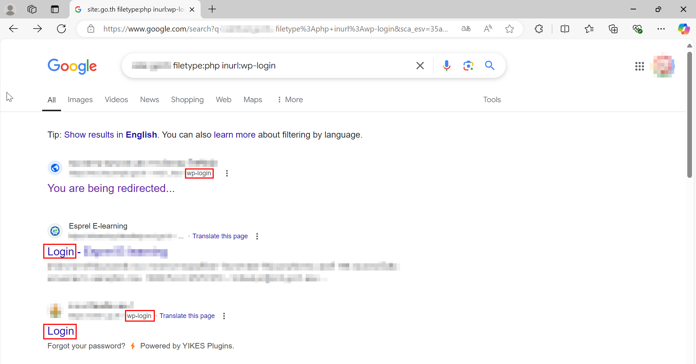
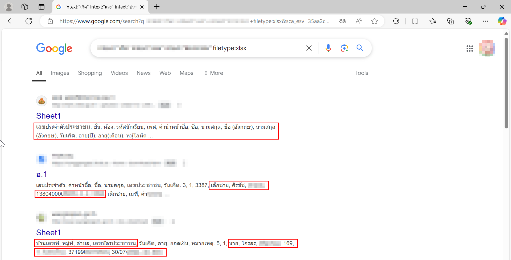
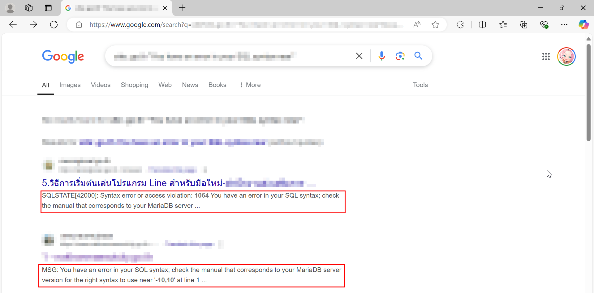
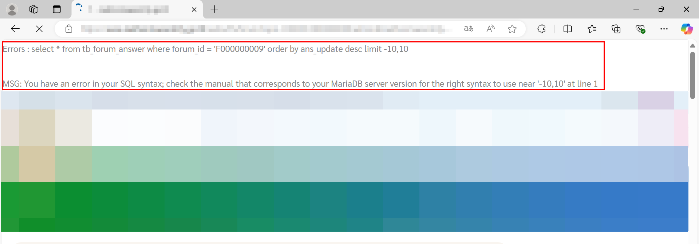

# Conduct Search Engine Discovery Reconnaissance for Information Lackage

**ภาษาไทย:** การรวบรวมข้อมูลของเป้าหมายด้วย Search Engine
- [ความเสี่ยง](#ความเสี่ยง)
- [การทดสอบ](#ตัวอย่างวิธีการทดสอบ-test-case)
- [การแก้ไข](#การแก้ไขเบื้องต้น)
- [อ้างอิง](#อ้างอิง)

## ข้อมูลที่ควรเข้าใจ

การที่เว็ปไซต์นึงจะปรากฎบนผลการค้นหาของ Search Engine ไม่ว่าจะเป็น Google, Bing, หรือ Yahoo นั้น เว็ปไซต์นั้นๆ จะต้องถูก Indexing หรือ Raking โดย Search Engine นั้นๆ ซึ่งมีหลายปัจจัยที่จะทำให้เว็ปไซต์นั้นถูกค้นพบโดย Search Engine ไม่ว่าจะเป็นการใช้ robots.txt, การปรับแต่งเนื้อหาให้เข้ากับ Title ของ Website, การใช้ HTML Element ต่างๆ, หรือการทำ Backlinks เป็นต้น ซึ่งกระบวนการในการปรับแต่ง Website ให้ถูกค้นเจอโดย Search Engine เรียกว่า Search Engine Optimization (SEO)

## ความเสี่ยง

การที่เนื้อหาของ Website บางส่วนที่ไม่ได้มีความจำเป็นต่อการโฆษณาหรือการเข้าถึงองค์กรนั้นอาจจะถูกเปิดเผยในผลลัพธ์ Search Engine ไปด้วย โดยตัวอย่างและความเสี่ยงนั้นขึ้นอยู่กับเนื้อหาที่ปรากฎ
- **หน้า Admin:** การที่ Path สำหรับจัดการเนื้อหา Website หรือแอดมินมีการถูกค้นพบใน Search Engine ไม่ใช่เพียงแค่เป็นการเปิดเผย Architecture ของ Website แต่ยังอาจกระตุ้นให้แก่เด็กๆ ร้อนวิชาอยากลอง Hack Website อีกด้วย ไม่ว่าจะเป็นการลองสุ่มรหัส การทำ SQL Injection หรือการทำ Phishing เป็นต้น

**ภาพที่ 1:** การใช้ Google ค้นหาเว็ปไซต์รัฐบาลไทยที่มีการใช้ Wordpress โดยกรองจากหน้า wp-login.php - เพียงแค่นี้ Hacker ก็ประหยัดเวลาในการเรียนรู้เป้าหมายแล้ว แค่ศึกษาช่องโหว่ Wordpress จากเอกสารตีพิมพ์สาธารณะก็มีโอกาสที่จะโจมตีสำเร็จ


- **หน้าที่มีข้อมูลส่วนบุคคล:** การที่ข้อมูลส่วนบุคคลของเว็ปไซต์ไม่ว่าจะเป็น ชื่อ-นามสกุล เลขบัตรประชาชนหรือเบอร์โทรศัพท์นั้นถูกค้นพบโดย Search Engine อาจทำให้เสี่ยงต่อการเกิดข้อมูลรั่วไหลอาจถึงขั้นผิดกฎหมาย PDPA ก็เป็นได้

**ภาพที่ 2:** การใช้ Google ค้นหาข้อมูลส่วนบุคคล เช่น เลขบัตรประชาชน ที่อยู่ หรือ วันเดือนปีเกิด จากองค์กรเป้าหมาย - การรั่วไหลแบบนี้อาจทำให้องค์กรถูกลงโทษทางกฎหมายได้


- **หน้า Error:** การที่หน้า Error ของเว็ปไซต์ถูกค้นพบผ่าน Search Engine นั้นไม่ใช่แค่ช่วยประหยัดเวลาให้กับผู้ไม่หวังดีแต่ยังเป็นการให้ข้อมูลที่ค่อนข้างมีประโยชน์แก่ Hacker อีกด้วย โดยปกติแล้วหน้า Error จะประกอบไปด้วยชื่อซอฟต์แวร์และเวอร์ชันของ Website ทำให้ Scope การโจมตีได้ง่ายขึ้น 

**ภาพที่ 3:** การใช้ Google ค้นหาหน้า Error ของค์กรหนึ่งในทีนี้เป็น SQL Error ซึ่งเป็นหน้าที่ช่วยเพิ่มโอกาสสำเร็จในการโจมตีด้วย SQL Injection

- และหน้าอื่นๆ ที่อาจขึ้นอยู่กับการประเมิณแต่ละบุคคลว่ามีความเสี่ยงมากแค่ไหน

**ภาพที่ 4:** ตัวอย่างหน้าเว็ปไซต์ที่มาจากผลการค้นหาของภาพที่ 3 ที่มี SQL Error จากภาพมีโอกาสถึง 90% ที่เว็ปไซต์นี้สามารถถูกโจมตีด้วย SQL Injection และทำการเข้าควบคุมตัว Server ได้ทันที


## ตัวอย่างวิธีการทดสอบ (Test Case)

- ค้นคว้าด้วย Google [(Google Dorking)](./1-Google.md)
- ค้นคว้าด้วย Microsoft Bing [(Bing Dokring)](./2-Bing.md)
- ค้นคว้าด้วย DuckDuckGo [(DuckDuckGo)](./3-DuckDuckGo.md)
- ค้นคว้าด้วย Baidu [(Baidu)](./4-Baidu.md)
- ค้นคว้าด้วย เนื้อหาที่ถูกบันทึกและ Freeze เอาไว้ในอดีต[(Internet Archive Wayback Machine)](./5-Internet_Archive.md)
- ค้นหาด้วย ฐานข้อมูลอุปกรณ์ที่อยู่บน Internet[(IoT-Database)](./6-IoT-Database.md)
- วิธีอื่นๆ [(Other)](./7-Other.md)

## การแก้ไขเบื้องต้น

### 1. ทำการใช้ robots.txt หรือ Configure robots.txt ให้ปลอดภัย

```txt
User-agent: *
Disallow: /secretpath/
Disallow: /adminlogin/
Disallow: /wp-admin/

User-agent: *
Allow: /contact/
Allow: /page/
Allow: /company/

Sitemap: https://www.example.com/sitemaps/sitemap-index.xml
```

การใช้งาน robotst.txt แบบเบื้องต้น
- User-Agent เอาไว้ระบุ Engine ที่ใช้ในการติดต่อเว็ปของเรา เช่น Firefox, Chrome, Google Crawl Bot, Bing Bot เป็นต้น
- Disallow เอาไว้ระบุ Path ที่ไม่ต้องการให้ปรากฎบนผลลัพธ์การค้นหา นี่คือส่วนที่ใช้ในการป้องกันไม่ให้ Search Engine ค้นพบหน้าที่มีความเสี่ยง สมมติไม่อยากให้เจอหน้า Login Wordpress ก็ใส่ `Disallow: /wp-admin/`
- Allow เอาไว้ระบุ Path ที่ต้องการปรากฎบนผลการค้นหา โดยปกติ Path ที่ไม่ได้อยู่ใน Disallow จะเป็น Allow โดยเสมอ
- Sitemap: เอาไว้ระบุ Path สำหรับ Sitemap

ข้อดีการใช้งาน robots.txt
- ช่วยเพิ่มโอกาสในการที่ Search Engine จะ Index เว็ปไซต์ส่งผลต่อยอดการเข้าถึงและโฆษณาเป็นต้น
- ช่วยบอก Search Engine ว่าหน้าไหนไม่ควรปรากฎบนผลลัพธ์ ป้องกันข้อมูลรั่วไหล หรือการให้ข้อมูลเพิ่มเติมแก่ Hacker

ข้อจำกัดการใช้งาน robots.txt
- หากต้องการจะซ่อนหน้าลับ เช่น `/secretpath/` หรือ `/wp-admin/` เพื่อไม่ให้ปรากฎบนผลการค้นหา, Hacker จะสามารถกดเข้าไปดูไฟล์ robots.txt ได้ตรงๆ แล้วก็จะพบกับ Path ลึกลับที่อยู่ใน `Disallow` ซ่อนจาก Search Engine ได้แต่ซ่อนจาก Hacker ไม่ได้
- บาง Search Engine อาจจะไม่สนใจ robots.txt ก็ได้

### 2. ต้องมี Session/Login ก่อนถึงจะดูได้ (Best)

โดยปกติแล้วถ้าเนื้อหาส่วนไหนต้องอาศัยการ Login หรือถ้าเข้าแบบไม่ได้ Login จะโดนเด้งกลับมาหน้า Login นั้นจะไม่ถูก Index โดย Search Engine หรือสั้นๆ จะไม่มีทางปรากฎบนผลการค้นหา (ย้ำว่า Search Engine ส่วนใหญ่นะ) ดังนั้นแล้วถ้าเราห่วงหน้าหน้าไหนมันอาจจะถูกดูดไปใส่ใน Result ก็บังคับให้มันมีการ Login ก่อนถึงจะดูเนื้อหาได้

ตัวอย่างการ Implement หน้าเว็ปให้มีการเช็ค Session/Login เสมอ

PHP
```PHP
session_start();
if (!isset($_SESSION['user_id'])) {
    // Redirect to login or return unauthorized error
    header("Location: /login.php");
    exit();
}
```

Python - Flask
```Python
from flask import session, redirect

@app.route('/protected-path')
def protected():
    if 'user_id' not in session:
        return redirect('/login')
    return "You are authenticated!"
```

Node.js (Express)
```JavaScript
const session = require('express-session');

app.use(session({
  secret: 'your_secret_key',
  resave: false,
  saveUninitialized: true
}));

app.get('/protected-path', (req, res) => {
  if (!req.session.userId) {
    return res.redirect('/login');
  }
  res.send('You are authenticated!');
});
```

### 3. X-Robots-Tag
เป็น HTTP Header ที่เอาไว้ระบุพฤติกรรมของ Search Engine เมื่อมีการพยายามจะเข้าถึง Path นั้นๆ

- `X-Robots-Tag: noindex` แปลว่าห้าม Search Engine นำหน้านี้ไปใส่ในผลลัพธ์การค้นหา
- `X-Robots-Tag: nofollow` แปลว่าห้าม Search Engine ทำการ Crawl ลิงค์อื่นๆ ต่อไปจากหน้าปัจจุบัน
- `X-Robots-Tag: noarchive` แปลว่าห้าม Cache หน้านี้
- `X-Robots-Tag: noimageindex` แปลว่าห้าม Index หรือนำภาพไปโชว์ในผลการค้นหา
- `X-Robots-Tag: notranslate` แปลว่าห้ามแปลภาษาหน้านี้
- เราสามารถใส่หลายๆ ค่าได้ในคราวเดียวเช่น `X-Robots-Tag: noindex, nofollow` ซึ่งปกติจะนิยมตั้งค่าแบบนี้สำหรับหน้าที่ไม่ต้องการให้ปรากฎบนผลการค้นหา
- หรือสามารถระบุเลยว่าไม่อยากให้ Search Engine ไหนเจอ `X-Robots-Tag: googlebot: noindex,nofollow`

ตัวอย่างการ Configure

Apache (.htaccess)
```txt
<Directory "/path/to/secret">
    Header set X-Robots-Tag "noindex, nofollow"
</Directory>
```

Nginx (nginx.conf)
```txt
server {
    listen 80;
    server_name example.com;

    location /secret {
        add_header X-Robots-Tag "noindex, nofollow";
    }
}
```
ข้อจำกัดของวิธีนี้
- ไม่ใช่ทุก Search Engine จะปฏิบัติตาม `X-Robots-Tag` เสมอไป
- จำเป็นต้องมีสิทธิ์ในการเข้าถึงไฟล์ Configuration บน Server เพื่อทำการ Configure ไฟล์เช่น .htaccess, nginx.conf

### 4. ใช้ Meta Tags
Search Engine นอกจากจะปฏิบัติตาม `X-Robots-Tag` การใช้ HTML element `<meta>` ก็สามารถให้ผลลัพธ์เช่นเดียวกัน นั่นหมายความว่าเราเลือกได้ว่าจะใช้แค่วิธีที่ 3 หรือ 4 อย่างเดียวก็ได้ไม่จำเป็นต้องมีทั้งคู่

ตัวอย่างการใช้งาน (ความหมายของ content เหมือนกับวิธีที่ 3)
```
<meta name="robots" content="noindex, nofollow">
<meta name="robots" content="index, follow">
<meta name="robots" content="noarchive">
<meta name="googlebot" content="noindex, nofollow">
<meta name="robots" content="noindex, nofollow" lang="en">
```

ข้อดีของวิธีที้
- ไม่จำเป็นต้องเข้าถึงหรือแก้ไขไฟล์ Configuration บน server สามารถแก้ที่ไฟล์เว็ปเราได้เลย

ข้อจำกัดของวิธีนี้
- ไม่ใช่ทุก Search Engine จะปฏิบัติตาม `X-Robots-Tag` เสมอไป

### 5. ใช้ CAPTCHAs
การที่หน้าใดๆ หน้านึงต้องมีการใช้ CAPTCHA Bot ของ Search Engine จะไม่สามารถเข้าถึงหน้านั้นได้ทำให้ไม่สามารถนำไปเก็บในผลลัพธ์ของการค้นหาได้ แต่วิธีนี้อาจจะทำให้ User ลำบากก็ได้

### 6. Review and Revise
หมั่นเช็คและตรวจสอบให้แน่ใจว่าไม่มีหน้าใดในเว็ปไซต์เก็บข้อมูลเกินความจำเป็น หรือหมั่นตรวจสอบด้วยตัวเองว่ามีเนื้อหาใดบ้างที่ปรากฎบนผลการค้นหาจากหลาย Search Engine

## อ้างอิง
- [OWASP (2024) - WSTG-INFO-01](https://owasp.org/www-project-web-security-testing-guide/v42/4-Web_Application_Security_Testing/01-Information_Gathering/README)
- [Impreva (2024) - Google Hacking](https://www.imperva.com/learn/application-security/google-dorking-hacking/)
- [Offsec (2024) - Google Hacking Database](https://www.exploit-db.com/google-hacking-database)
- [Joshua Hardwick (2024) - Complete Google Operators](https://ahrefs.com/blog/google-advanced-search-operators/)