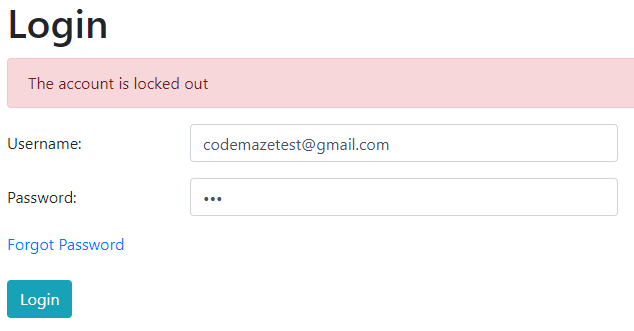

[< กลับสู่สารบัญหลัก](../README.md)

# ระบบอณุญาตให้กรอกรหัสผิดพลาดได้ไม่จำกัดจำนวนครั้ง

การที่ระบบอณุญาตให้ผู้ใช้งานสามารถกรอกรหัสผิดได้ซ้ำๆ หลายๆ ครั้งหรือตลอดไป เป็นจุดอ่อนของเว็บที่ไม่ดีซึ่งเป็นการอำนวยความสะดวกให้ Hacker ในการโจมตีด้วยการเดารหัสผ่านไปเรื่องๆ อาจจะสัก 1 ล้านครั้งแล้วดันถูกต้องก็เป็นได้ ซึ่งวิธีที่ดีที่สุดคือเขียนโปรแกรมป้องกันครับ ส่วนมาตราการการป้องกันที่เป็นที่นิยมได้แก่

- หากมีการใส่รหัสผิด 3 - 5 ครั้งจะมีระบบ Delay หรือ Cooldown แจ้งให้ผู้ใช้งานทำการรอสักครู่ถึงจะกรอกรหัสผ่านใหม่ได้



- หรือหากเริ่มมีการใส่รหัสผิดหลายครั้งให้มีการกรอก Captcha ในครั้งต่อไปเพื่อเพิ่มความยากและรำคาญแก่ผู้ไม่หวังดีที่กำลังเดารหัสผ่าน

- ทำการใช้ anti-CSRF ที่ผูกกับ Cookies และซ่อนอยู่ในฟอร์มลับ - ทุกๆ ครั้งก่อนล็อคอิน Website จะต้องให้คุกกี้แก่ผู้ใช้งานก่อนทุกครั้ง และจะมี input ลับซ่อนอยู่ในฟอร์ม Login เสมอ โดยเว็ปไซต์จะต้อง Track anti-CSRF กับ Cookie ของ User ทุกครั้ง หากมีการรีเฟรชหรือลอคอินใหม่ anti-CSRF กับ Cookie จะต้องเปลี่ยนไปตลอด ซึ่งการทำแบบนี้จะช่วยลดการโจมตีด้วยโปรแกรม Password Brute Force ได้บางส่วน (Hacker มือสมัครเล่นจะใช้โปรแกรมสำเร็จรูปในการโจมตีซึ่งจะจัดการพวกนี้ได้ แต่ Hacker มืออาชีพอาจจะสามารถเขียนโปรแกรมเพื่อ Bypass ได้อยู่ดี)
```
<form>
  Subject: <input type="text" name="Username"/><br/>
  Content: <input type="password" name="Password"/><br/>
  <input type="submit" value="Submit"/>
  <input type="hidden" name="anti-CSRF" value="R6B7hoBQd0wfG5Y6qOXHPNm4b9WKsTq6Vy6Jssxb"/>
</form>
```

- ทำการส่งอีเมลไปแจ้งเตือนผู้ใช้งานว่ามีการใส่รหัสผ่านผิดหลายครั้ง เพื่อจะได้ทราบว่ามีคนกำลังเดารหัสผ่านอยู่หรือไม่
- แอบเพิ่ม Delay สัก 1 - 2 วินาทีเพื่อทำให้ Hacker รำคาญ (พบได้ใน Facebook และ Gmail)

## แบบนี้ถ้าผมจำรหัสไม่ได้ก็โดนล็อคสิ
- อย่าลืมทำฟังก์ชัน Reset Password ให้ด้วยละ


