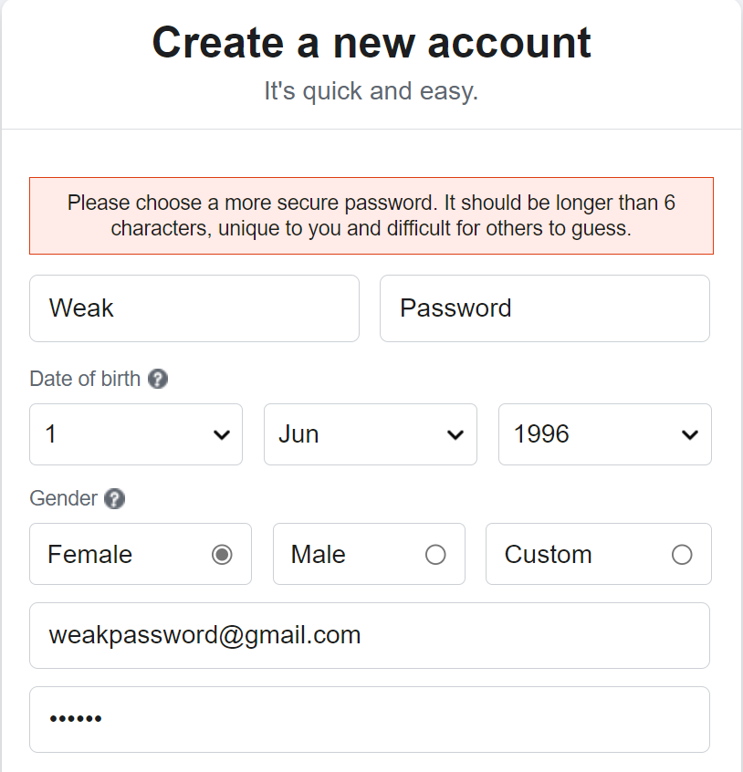
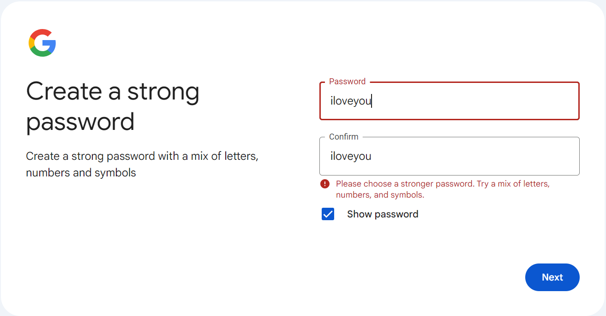

[< กลับสู่สารบัญหลัก](../README.md)

# ระบบอณุญาตให้มีการใช้งานรหัสผ่านที่อ่อนแอ

การที่ระบบอณุญาตให้ตั้งรหัสผ่านที่อ่อนแอนั้นจะเป็นการเพิ่มโอกาสสำเร็จในการโจมตี Password Brute Force Attack หรือการคาดเดารหัสผ่าน ซึ่งตัวอย่างรหัสผ่านอ่อนแอนั้นได้แก่

- รหัสผ่านที่สั้นมากๆ เช่น 1 - 5 ตัวอักษร
- รหัสผ่านที่มีแต่ตัวเลขอย่างเดียว เช่น PIN Code
- รหัสผ่านที่มีแค่ตัวอักษรเท่านั้น
- รหัสผ่านที่มีการใช้บ่อยๆ เช่น 12345, iloveyou

ซึ่งโปรแกรมที่ดีควรมีข้อบังคับตอนการสมัครเข้าสู่ระบบแก่ผู้ใช้งานว่าต้องตั้งรหัสผ่านที่มีความซับซ้อนเท่านั้นถึงจะอณุญาตให้สมัครหรือเข้าสู่ระบบได้ ซึ่งตัวอย่างกฎในการบังคับการใช้งานรหัสผ่านที่ซับซ้อนได้แก่

- รหัสผ่านจะต้องมีทั้งตัวพิมพ์เล็กและพิมพ์ใหญ่
- รหัสผ่านจะต้องมีทั้งตัวเลขและอักษรพิเศษ
- รหัสจะต้องมีความยาวไม่น้อยกว่า 7 ตัวอักษร
- รหัสผ่านจะต้องไม่ใช่คำที่เป็นที่นิยม เช่น 12345, iloveyou, thailand เป็นต้น

นี่คือตัวอย่างระบบบังคับรหัสผ่านซับซ้อนของ Facebook
- สมัครบัญชีด้วยรหัสผ่าน 123456
- Facebook ไม่อนุมัติและแจ้งกว่าต้องใช้รหัสผ่านที่ยาวกว่านี้และต้องไม่ใช่คำที่เดาง่ายๆ

นี่คือตัวอย่างระบบบังคับรหัสผ่านซับซ้อนของ Gmail
- สมัครบัญชีด้วยรหัสผ่าน iloveyou
- ระบบไม่อนุมัติและแจ้งว่ารหัสผ่านควรจะต้องประกอบไปด้วยตัวเลข ตัวอักษรพิเศษ และตัวพิมพ์อื่นๆ

## ทำไมผู้ใช้งานเลือกที่จะตั้งรหัสผ่านง่ายๆ
- แน่นอนครับความขี้เกียจไง ขี้เกียจจำเลยตั้งง่ายๆ ไว้ก่อน

## แล้วถ้ารหัสผ่านอ่อนแอเสี่ยงอะไรบ้าง
- เหมือนที่กล่าวไปข้างต้นเสี่ยงต่อการคาดเดาจากผู้ไม่หวังดีและทำการยีดบัญชีได้
- กรณีอีกอันที่น่าสนใจก็คือเวลาฐานข้อมูล Username และ Password ของเรานั้นถูกดูดออกมา ถ้าสมมติว่าฐานข้อมูลของคุณเก็บ Password ในรูปแบบของ Hash หรือการเข้ารหัส(เช่น MD5, SHA-1, หรือ SHA-2) มันจะช่วยเพิ่มความยากให้แก่ Hacker ในการเจาะหรือ Crack Hash ของคุณได้ เป็นการเพิ่มเกราะป้องกันไปอีกชั้นนึง

## จะรู้ได้อย่างไรว่ารหัสผ่านปลอดภัย
- ทดสอบกับ [Kasperky Password Checker](https://password.kaspersky.com/) ที่จะบอกว่ารหัสผ่านของคุณเป็นที่นิยมขนาดไหนโดยอ้างอิงจากฐานข้อมูลที่ถูก Hacker ขโมยมา
- ทดสอบกับ [Password Monster](https://www.passwordmonster.com/) ที่จะบอกทั้งจุดอ่อนและเวลาที่จะถูกแกะโดย Hacker